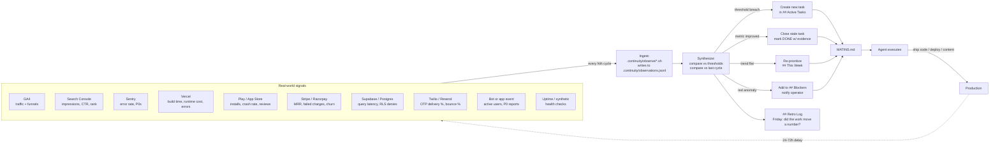

# Analytics Feedback Loop

This is the part of Matins that most agent-state frameworks don't have, and it's the reason matins agents don't drift.

## The problem

A markdown TODO list for an agent is fine for one day. After a week, the agent is shipping work that nobody asked for, fixing bugs nobody hit, and optimizing pages nobody visits. Without an external signal of what *actually moved in the real world*, the agent's priorities calcify around what was urgent on day one.

## The shape



## Directory layout

Each project keeps a `.continuity/` directory at the repo root:

```
.continuity/
├── README.md                 # what lives here
├── thresholds.yaml           # per-signal red/yellow/green bands
├── observations.jsonl        # append-only telemetry, one row per pull (gitignored)
└── observe/
    ├── sentry.sh             # pulls Sentry API
    ├── ga4.sh                # pulls GA4 via MCP or REST
    ├── gsc.sh                # pulls Search Console
    ├── vercel.sh             # `vercel inspect`, `vercel logs`
    ├── play-store.sh         # androidpublisher API (mobile only)
    ├── stripe.sh             # Stripe events API
    ├── supabase.sh           # psql -c "SELECT pg_stat_*"
    ├── twilio.sh             # delivery %
    ├── synth.sh              # diff latest vs prior, emit task suggestions
    └── README.md             # how to add a new observe script
```

The agent runs `bash .continuity/observe/*.sh` on the **Monday cycle** (full pull) and `bash .continuity/observe/<critical>.sh` every cycle (just the red-band signals — Sentry, uptime, crash rate). `synth.sh` reads `observations.jsonl`, compares to `thresholds.yaml`, and prints a list of suggested task deltas which the agent then writes into `## Active Tasks`.

## The threshold file

`.continuity/thresholds.yaml` defines red/yellow/green bands per signal. The agent reads this on every synth cycle.

```yaml
# .continuity/thresholds.yaml — example
signals:
  sentry_error_rate_24h:
    green: "<0.5%"
    yellow: "0.5%-1%"
    red: ">1%"           # → P0 fix task, notify operator
  vercel_runtime_gbhrs_24h:
    green: "<5"
    yellow: "5-20"
    red: ">20"           # → cron / route audit task
  ga4_signups_24h:
    baseline: 10         # 30-day rolling median, auto-updated by synth
    red_if_below_pct: 33 # signup drop >67% from baseline → outreach task
  play_crash_rate_7d:
    green: "<0.5%"
    yellow: "0.5%-1%"
    red: ">1%"           # → halt rollout, root-cause task
  gsc_top10_ctr_28d:
    baseline: auto       # auto-tracked rolling 28-day median
    red_if_drop_pct: 20  # >20% CTR drop on a top-10 page → rewrite task
  stripe_failed_charges_pct_24h:
    green: "<2%"
    yellow: "2%-5%"
    red: ">5%"           # → billing health task
```

Edit this file when you want to tune sensitivity. The agent itself will propose threshold updates in the Friday retro when it sees a band consistently misfire ("yellow band on `vercel_runtime_gbhrs_24h` triggered 6× this week with no real issue — consider raising").

## Observations log

`.continuity/observations.jsonl` is append-only. Every observe-script run writes one JSON line:

```json
{"ts":"2026-05-26T14:00:00Z","signal":"sentry_error_rate_24h","value":0.34,"band":"green","raw":{"events":127,"users_affected":12}}
{"ts":"2026-05-26T14:00:01Z","signal":"vercel_runtime_gbhrs_24h","value":3.2,"band":"green","raw":{"by_route":[{"route":"/api/health","gb_hrs":0.4}]}}
{"ts":"2026-05-26T14:00:02Z","signal":"ga4_signups_24h","value":14,"band":"green","baseline":12,"raw":{"by_source":{"organic":9,"direct":5}}}
```

This file is gitignored (telemetry shouldn't live in git), but `.continuity/thresholds.yaml` and the observe scripts themselves *are* committed.

## Auto-task suggestion format

`synth.sh` reads recent `observations.jsonl` rows, diffs them against thresholds, and prints suggestions in the exact format the agent pastes into `## Active Tasks`:

```
- **Task:** Investigate Sentry error spike on /api/import/template (47 events/hr, baseline 2/hr, red since 2026-05-26T13:42)
- **Venture:** <project>
- **Owner:** agent
- **Deadline:** 2026-05-27   # 24h SLA on red-band auto-tasks
- **Status:** TODO
- **Tracker:** auto-synth-2026-05-26-sentry-import-template
- **Last Verified:** 2026-05-26
- **Next Check:** 2026-05-27
- **Success Criteria:** error rate back to <0.5%/hr OR root cause documented in ADR
- **Outcome:**
```

The agent then chooses whether to actually paste it (deduplicate against existing tasks, sanity-check the threshold breach against recent deploys).

## What this looks like in practice

A week in the life of a matins project's signal loop:

**Monday 06:00.** Full pull. GSC shows a new keyword ("react expense splitter") entering rank 18. Synth emits a content-expansion task. Agent reads it, picks it up Tuesday, ships a blog post Wednesday. By Friday GSC shows the page indexed at rank 14.

**Wednesday 14:00.** Red-band pull. Sentry error rate jumps from 0.3% to 1.4% on `/api/checkout`. Synth emits a P0 task. Agent picks it up immediately (preempts whatever was in `## This Week`), bisects to the morning's deploy, ships a fix, error rate back to 0.4% within an hour. Lesson promoted to ADR.

**Friday 17:00.** Retro. The week shipped 4 tasks. 3 moved a measurable number (signups +12%, error rate restored, new keyword indexed). 1 was a refactor with no measurable signal — the retro flags it as "shipped but no movement to report" so the agent gets explicit about whether next week's refactors should wait for a metric to chase.

That feedback discipline is the whole point. The agent doesn't ship features into the void.

## How this differs from "agent with a TODO list"

| | TODO-list agent | matins agent |
|---|---|---|
| Where do tasks come from? | Human writes them | Signals + human + retro |
| What closes a task? | Agent says "done" | Metric moved + commit shipped |
| How does priority shift? | Manual reorder | Red-band signals preempt |
| Does the agent know if its work mattered? | No | Friday retro answers this |
| What happens to stale tasks? | They linger | Monday cadence flags >14d as blocker candidates |

## What you have to set up

To turn on the feedback loop:

1. **Pick which signals matter for your domain profile.** Start with 2-3, not 10.
2. **Copy the relevant scripts from `templates/observe/` to `.continuity/observe/`.**
3. **Edit each script's credential section.** Most pull from env vars (`SENTRY_AUTH_TOKEN`, `GA4_PROPERTY_ID`).
4. **Write `.continuity/thresholds.yaml`** with bands for those signals.
5. **Add `.continuity/observations.jsonl` to `.gitignore`.**
6. **Let it run.** First Monday cycle does the bootstrap pull and seeds tasks.

You can skip the analytics loop entirely (just don't put scripts in `observe/`). The agent will still run, just without the external signal. You'll lose the differentiator, but the framework works either way.

## Future: shared baselines

A planned v1.x feature: opt-in shared baselines. If you anonymize and contribute your observation rollups (just the bands, not the raw data), the framework can compute cross-project medians — "the median pre-launch B2B SaaS has 3.2 signups/day" — and your synth can flag when you're below the median. Off by default, opt-in via `.continuity/share-baselines: true`.

This will never include raw observation data, only band-level aggregates with k-anonymity guarantees. See the in-progress ADR `docs/decisions/0002-shared-baselines.md`.
