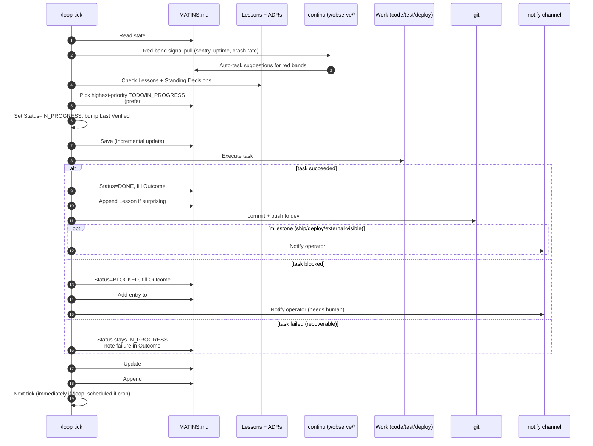
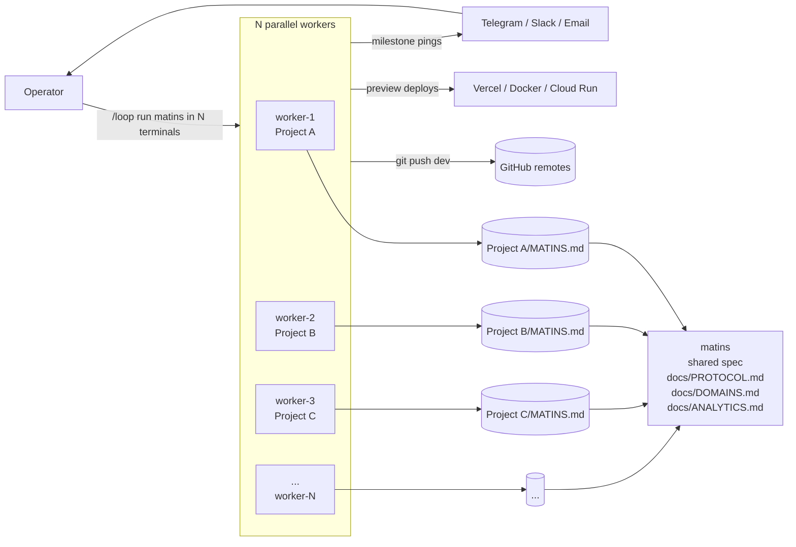

# Architecture

Matins has two diagrams worth understanding: the **single-worker harness** (what one `/loop` tick does, mechanically), and the **multi-project operator model** (how one human runs N autonomous projects in parallel).

## Single-Worker Harness

What happens inside one `/loop run matins` tick.

The shape is identical every cycle. The variation is in which task gets picked and what work it requires.

## Multi-Project Operator Model

How one human (the "operator") runs many matins agents simultaneously, one per project, with no central coordinator.

The workers share **nothing at runtime** — no shared state, no central queue, no coordinator. They share only:

- The framework spec (read-only, in this repo).
- The operator's git credentials.
- The notify channel (so the operator gets one stream of milestones).

This means:

- **Scaling is linear.** Adding a 7th project = 1 new terminal + 1 new `MATINS.md`. No central component to upgrade.
- **One worker dying doesn't affect the others.** No queue to drain, no lock to release.
- **The framework itself is portable.** Each `MATINS.md` is self-contained — you can move a project to a different machine and the agent picks up exactly where it left off.

## Why one file, not a database

Matins keeps state in a single markdown file in the repo. The obvious alternative is a database (SQLite, Postgres, vector store). We chose markdown deliberately:

| | Markdown file | Database |
|---|---|---|
| Diffable | ✅ `git diff MATINS.md` | ❌ |
| Reviewable | ✅ human-readable | ❌ |
| Version-controlled | ✅ free | ❌ separate backup story |
| Portable across machines | ✅ `git clone` | ❌ |
| Portable across agent runtimes | ✅ any agent that reads text | ❌ schema lock-in |
| Survives "I lost my laptop" | ✅ via remote | △ depends on backup |
| Onboarding ergonomics | ✅ readable in any editor | ❌ requires tooling |
| Multi-writer concurrency | ❌ merge conflicts possible | ✅ |
| Query performance | ❌ linear scan | ✅ indexed |

Two writers are uncommon in matins (one agent + maybe one human edit per day), so the merge-conflict cost is low. Query performance doesn't matter because the file is capped at 200 lines. Everything else, markdown wins.

`.continuity/observations.jsonl` is the one exception — append-only telemetry doesn't need to be human-reviewed, just queryable, and a JSONL file streams better than a markdown table. But it's still a file, not a database.

## Why no central scheduler

Matins agents are self-paced via the `/loop` mechanism in the agent runtime (Claude Code's `/loop`, Cursor's equivalent, a `while true` shell loop for generic LLMs). We deliberately don't ship a scheduler.

**Centralized schedulers (cron, GH Actions cron, Vercel cron) failed us repeatedly in practice:**

- An unbounded cron route burned 99.7% of team compute in 24 hours in May 2026 (the incident that produced the default `## Standing Decisions` against re-enabling crons without per-route audit).
- A GitHub Actions cron that ran every 6 hours kept missing the actual signal change because the signal moved on a different cadence than the cron.
- A cron with a bug fires N times before anyone notices; a self-paced agent that hits the same bug stops immediately and goes BLOCKED.

Self-pacing in the agent runtime means: the agent decides when to run again. If there's a red-band signal, it runs in 60 seconds. If everything's green and the backlog is empty, it sleeps for 30 minutes. The runtime's wakeup mechanism (e.g. Claude Code's `ScheduleWakeup`) is the only timer.

If you want cron-style execution anyway, wrap it: a cron job that does `/loop run matins` once and exits. You lose the self-pacing but you can keep using your existing infrastructure.

## Implementation surface

Today, matins is:

- **Specification** (`docs/PROTOCOL.md`, `docs/DOMAINS.md`, `docs/ANALYTICS.md`, `docs/ARCHITECTURE.md`).
- **Templates** (`templates/MATINS.md`, `templates/observe/*.sh`, `templates/observe/synth.sh`).
- **Examples** (`examples/*/MATINS.md`).

There is **no compiled runtime**. The agent itself (Claude Code / Cursor / your LLM of choice) is the runtime. We don't ship a Python or Node package that does the loop — your agent does.

This makes the surface small (~30 files) and the install trivial (copy two directories into your repo). It also makes adapter integrations easy: matins doesn't care which LLM you use as long as it can read a markdown file and execute shell commands.

The v1.0 roadmap includes a thin CLI (`npx matins init`, `matins lint MATINS.md`) for ergonomics, but the framework itself remains a spec + templates.
